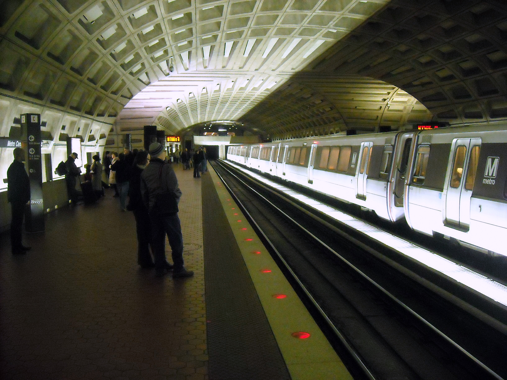

# fast_style_transfer
Implementing/playing around with code from tfhub.dev/google/magenta/arbitrary-image-stylization-v1-256/2

Visualization:

Requirements:
1. Python
2. Tensorflow
3. Matplotlib
4. Numpy
5. The magenta_arbitrary_image_stylization network, accessible here: https://tfhub.dev/google/magenta/arbitrary-image-stylization-v1-256/2, saved to the main folder.

Files:
1. fastTransfer.py, the main script
2. style_images/starry_night.jpg, from Wikimedia Commons: https://commons.wikimedia.org/wiki/File:VanGogh-starry_night.jpg
3. content_images/metro_center.jpg, also from Wikimedia Commons: https://commons.wikimedia.org/wiki/File:Metro_Center_station,_DC.JPG
4. stylized_images/metro_center.jpg, an image created by the code in this repository which translated the style of Starry Night by van Gogh onto the image of the Washington Metro!

Usage:
1. insert any images you'd like to transfer style from into style_images/.
2. Insert any images you'd like to transfer style ONTO into content_images/.
3. Edit fastTransfer.py so that content_image_path and style_image_path refer to the correct photos.
4. Run the script fastTransfer.py. On my machine: "python fastTransfer.py" works once all requirements are met.
5. Observe created images in stylized_images/!